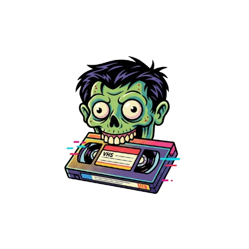

# Soundvi — Editor de Video con Visualización de Audio Modular

<p align="center">
  
</p>

**Soundvi** es una aplicación de escritorio para generar videos reactivos al audio, diseñada con una arquitectura modular "Plug and Play" basada en PyQt6.

## Características principales

- **Arquitectura modular**: Sistema de módulos categorizados (audio, video, texto, utilidades, exportación)
- **Visualizadores wav2bar-reborn**: Módulos de visualización de audio de alta calidad
- **Formato .soundvi**: Proyectos comprimidos y cifrados con soporte para medios embebidos
- **Timeline multi-pista**: Edición con múltiples pistas de video, audio, subtítulos y efectos
- **Sistema de perfiles**: Interfaces adaptadas (Básico, Creador, Profesional, Personalizado)
- **Undo/Redo**: Sistema de comandos para deshacer/rehacer acciones
- **Exportación flexible**: Múltiples formatos y configuraciones de render

## Módulos de Visualización (wav2bar-reborn)

Módulos inspirados en el proyecto [wav2bar-reborn](https://github.com/wav2bar-reborn):

| Módulo | Descripción | Categoría |
|--------|-------------|----------|
| **Barras Rectas** | Visualizador clásico con barras verticales, escalado logarítmico, suavizado temporal, sombras y modo espejo | Audio/Visualization |
| **Barras Circulares** | Barras dispuestas en círculo con rotación y barras espejo interiores | Audio/Visualization |
| **Flujo de Partículas** | Partículas reactivas con física (gravedad, fricción) y efecto glow | Audio/Visualization |
| **Onda de Audio** | Forma de onda suavizada con relleno, espejo vertical y glow | Audio/Visualization |
| **Filtros SVG** | Filtros avanzados: inversión, sepia, posterización, aberración cromática, térmico | Video/Effects |
| **Sombras y Bordes** | Sombras interiores, bordes decorativos y marcos | Video/Effects |
| **Imagen/Forma** | Imágenes con reactividad al audio (escala, rotación, opacidad) | Video/Generators |
| **Temporizador Visual** | Barra de progreso de tiempo con modos: barra, línea+punto, círculo | Utility |

## 💾 Sistema de Guardado/Carga (.soundvi)

### Formato .soundvi

El formato `.soundvi` es un archivo comprimido y cifrado que contiene todos los datos del proyecto:

```
proyecto.soundvi (cifrado con PBKDF2-HMAC-SHA256 + XOR)
└── [ZIP comprimido con DEFLATE]
    ├── manifest.json          # Metadatos, checksums, estructura
    ├── config/
    │   ├── project.json       # Configuración del proyecto
    │   ├── timeline.json      # Timeline serializado
    │   ├── modules.json       # Módulos activos y configuración
    │   ├── render.json        # Configuración de render
    │   └── media_library.json # Biblioteca de medios
    ├── media/                 # Archivos embebidos (opcional)
    │   ├── audio/
    │   └── images/
    ├── cache/
    │   └── thumbnails/
    └── history/
        └── actions.json       # Historial undo/redo
```

### Cifrado

- **Algoritmo**: XOR con clave derivada de PBKDF2-HMAC-SHA256 (100,000 iteraciones)
- **Integridad**: HMAC-SHA256 para verificar que los datos no fueron alterados
- **Salt**: 16 bytes aleatorios por archivo
- **Header**: `SNDV` (magic bytes) + versión + salt + HMAC + datos cifrados

### Uso

```python
# Guardar proyecto
from core.project_manager import ProjectManager

pm = ProjectManager()
pm.project_name = "Mi Proyecto"
pm.save_project("mi_proyecto.soundvi", embed_media=True)

# Cargar proyecto
pm2 = ProjectManager()
pm2.load_project("mi_proyecto.soundvi")
print(pm2.project_name)  # "Mi Proyecto"
```

### Desde la interfaz

- **Guardar**: `Ctrl+S` (guardado rápido) o `Archivo > Guardar como...`
- **Abrir**: `Ctrl+O` — soporta `.soundvi`, `.svproj` y `.json`
- **Formato recomendado**: `.soundvi` (comprimido, cifrado, portable)

## 🛠 Instalación

### Requisitos

- Python 3.10+
- PyQt6
- NumPy
- OpenCV (cv2)
- Pillow
- librosa (para visualización de audio)
- scipy

### Instalación rápida

```bash
pip install -r requirements.txt
python main.py
```

### Con perfil específico

```bash
python main.py --profile basico
python main.py --profile creador
python main.py --profile profesional
python main.py --profile personalizado
```

## 📁 Estructura del Proyecto

```
Soundvi/
├── main.py                    # Punto de entrada
├── core/                      # Lógica de negocio
│   ├── project_manager.py     # Gestor de proyectos
│   ├── soundvi_project.py     # Formato .soundvi (cifrado+compresión)
│   ├── timeline.py            # Timeline multi-pista
│   ├── commands.py            # Sistema undo/redo
│   └── ...
├── gui/                       # Interfaz gráfica
│   └── qt6/                   # Widgets PyQt6
│       ├── main_window.py     # Ventana principal
│       └── ...
├── modules/                   # Módulos plug-and-play
│   ├── core/                  # Base y registro de módulos
│   ├── audio/visualization/   # Visualizadores de audio
│   │   ├── straight_bar_module.py
│   │   ├── circular_bar_module.py
│   │   ├── particle_flow_module.py
│   │   ├── wave_visualizer_module.py
│   │   └── ...
│   ├── video/effects/         # Efectos de video
│   │   ├── svg_filter_module.py
│   │   ├── shadow_border_module.py
│   │   └── ...
│   ├── video/generators/      # Generadores visuales
│   │   └── image_shape_module.py
│   └── utility/               # Utilidades
│       └── timer_module.py
├── tests/                     # Suite de tests
│   └── test_soundvi_project.py
├── docs/                      # Documentación
│   ├── SAVE_LOAD_SYSTEM.md
│   └── WAV2BAR_MODULES.md
└── multimedia/                # Recursos visuales
```

## 📄 Licencia

Soundvi es un proyecto de código abierto.

