# Soundvi


---

### Que es esto

Soundvi es un editor de video modular con visualizacion de audio reactivo.
Si, otro editor de video. Como si el mundo necesitara uno mas.
Pero este tiene algo que los demas no: un sistema de perfiles que no te ahoga
con 47 paneles cuando solo quieres cortar un clip de 3 segundos.

La premisa es simple: si eres un usuario basico, ves herramientas basicas.
Si eres profesional, te damos todo y que Dios te ayude.
Si quieres personalizar, alla tu.

<p align="center">
  
  <br/>
  <em>Zoundvi. La mascota que nadie pidio pero que todos merecen.</em>
</p>

### Capturas de pantalla

A continuacion, evidencia de que esto realmente funciona (o al menos arranca):

#### Asistente de primer inicio

Cuando es tu primera vez (con Soundvi, pervertido), te recibe un wizard
paso a paso para que configures tu experiencia sin necesitar un manual.

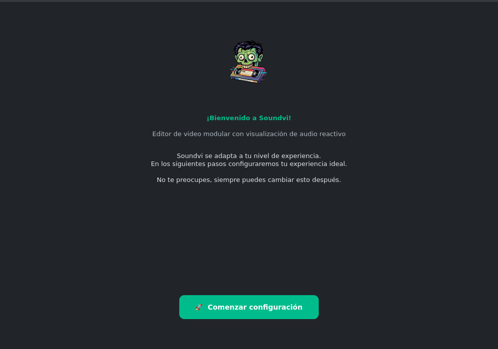

#### Seleccion de nivel

El wizard te deja elegir tu nivel de experiencia. La interfaz se adapta
segun lo que elijas: fuentes mas grandes para novatos, iconos mas compactos
para profesionales, tooltips detallados o minimalistas.

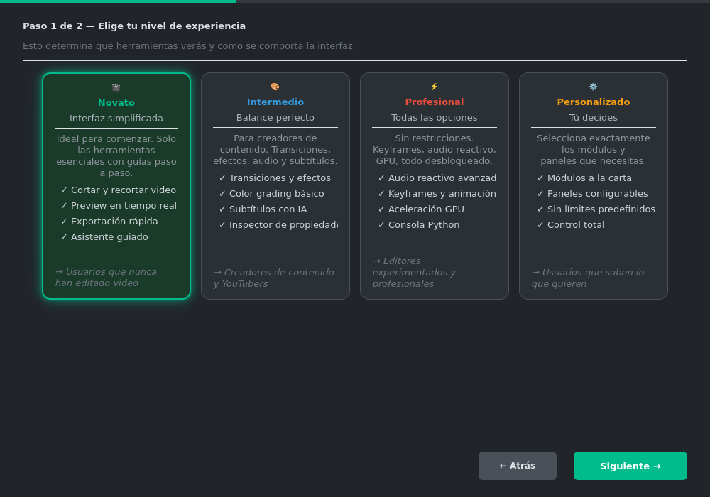

#### Seleccion de tema

Porque no todos quieren un fondo oscuro. Hay gente rara que prefiere
temas claros. No juzgamos (mucho).

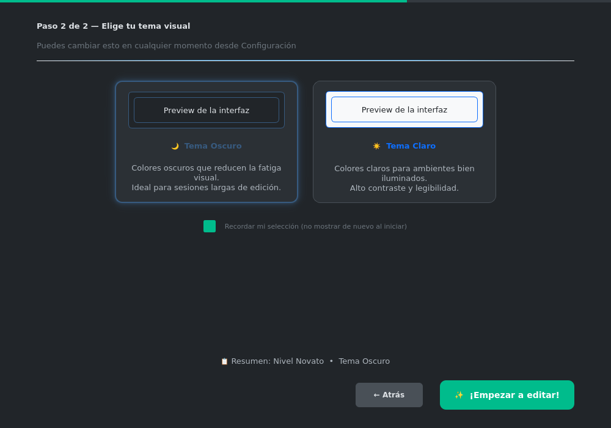

#### Selector de perfil (cambio rapido)

Para cuando ya no eres el mismo usuario de ayer y quieres cambiar
de nivel sin reiniciar la app.

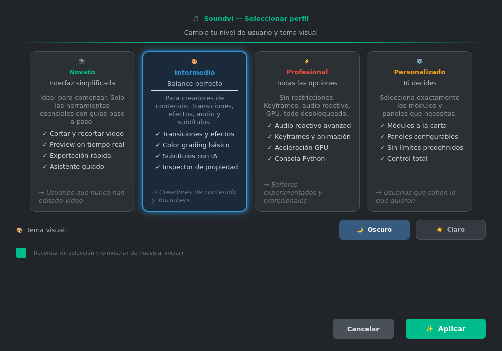

#### Modo Profesional
Todo activado. Todos los paneles. Todo el poder. Todo el caos.
Incluye consola Python, keyframes, y audio mixer.

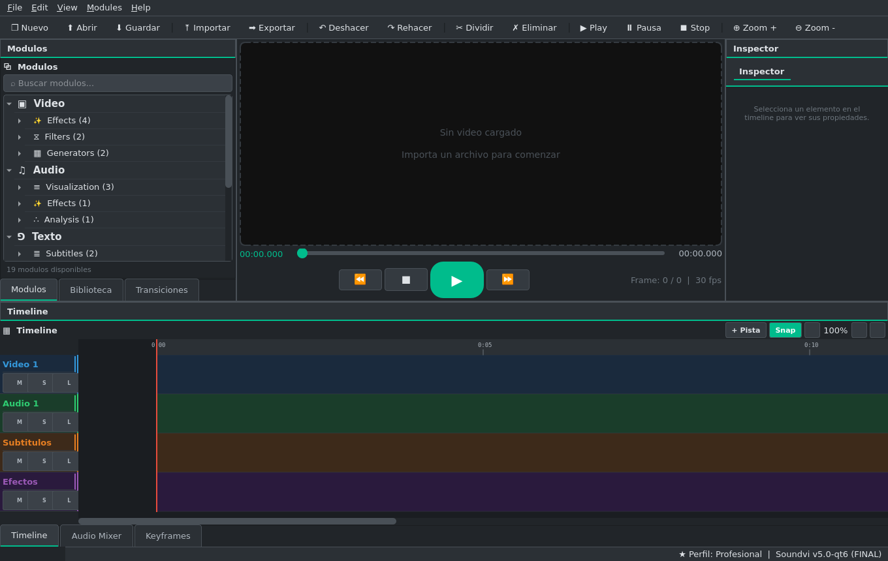

#### Modo Basico (Novato)
Para cuando solo necesitas cortar un video sin que la interfaz te insulte
con opciones que no vas a usar en tu vida. Incluye panel de Primeros Pasos
y wizard de bienvenida.

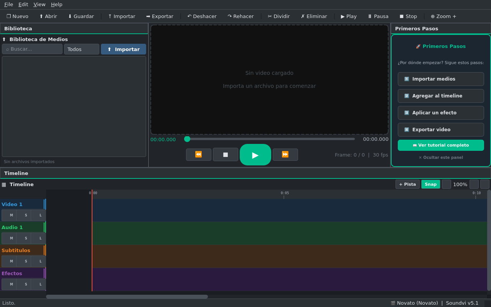

#### Modo Creador (Intermedio)
El punto medio. Transiciones, efectos, audio. Lo justo para hacer contenido
sin necesitar un manual de 200 paginas.

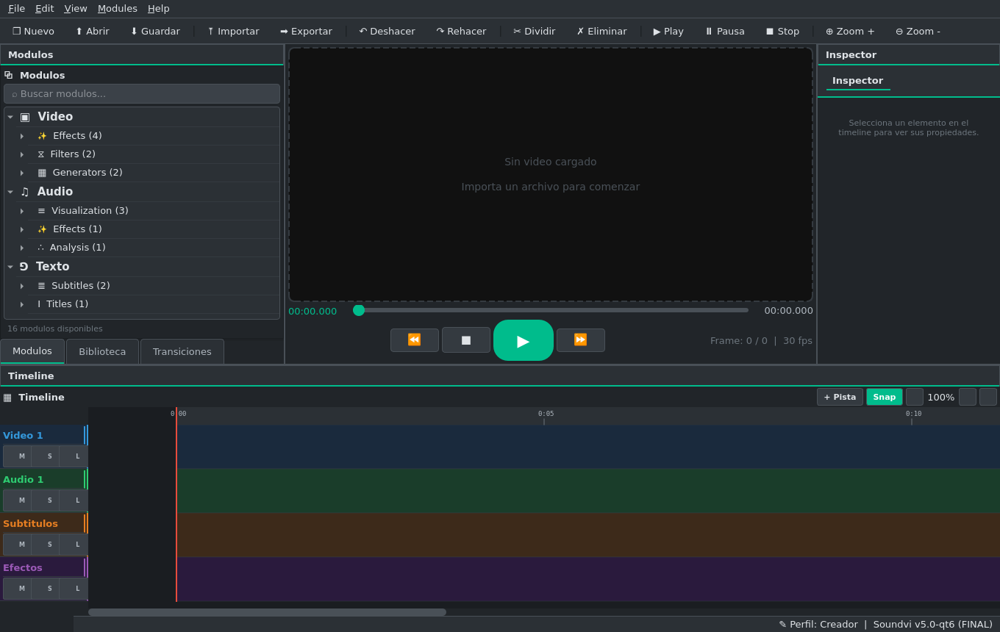

#### Tema Claro
Para los que editan video a las 3 de la tarde con la ventana abierta.

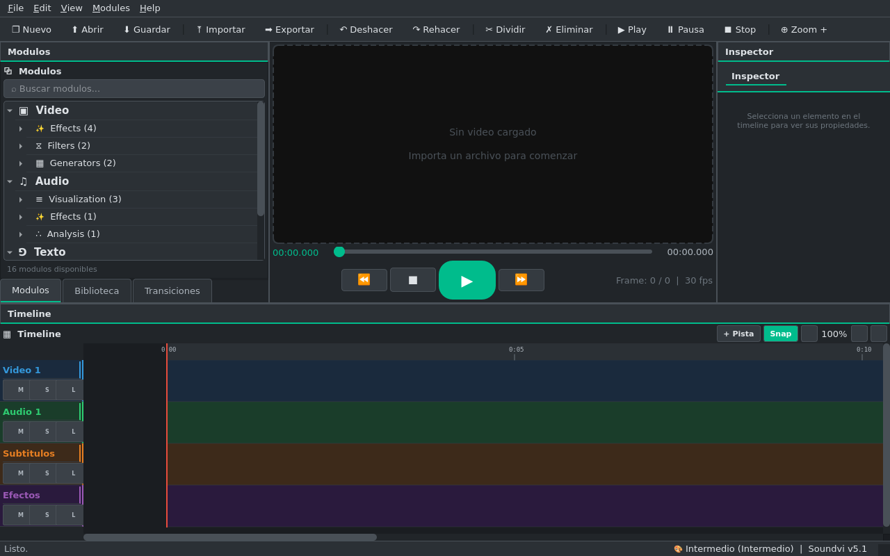

#### Dialogo de Exportacion
Porque exportar un video no deberia requerir un doctorado en codecs.

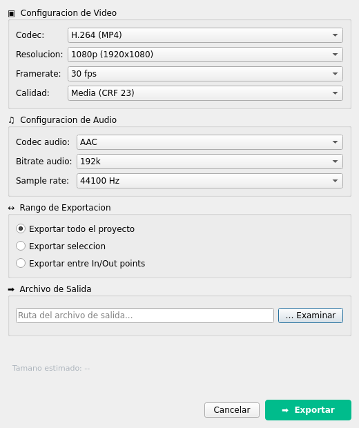


### Iconos del proyecto

Porque un proyecto sin iconos es como un video sin audio: tecnicamente funcional,
pero nadie lo quiere.

| Icono | Descripcion |
|-------|-------------|
|  | Modulos de video |
|  | Modulos de audio |
|  | Modulos de texto |
|  | Efectos visuales |
|  | Filtros |
|  | Exportacion |
|  | Utilidades |

Y los badges de perfil, para que te sientas especial:

| Basico | Creador | Profesional | Personalizado |
|--------|---------|-------------|---------------|
|  |  |  |  |

<p align="center">
  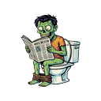
  <br/>
  <em>Icono de carga. No preguntes.</em>
</p>

---

### Instalacion

#### Requisitos previos

- Python 3.10 o superior (si todavia usas 3.7, tienes problemas mas grandes que instalar este software)
- FFmpeg en el PATH (o configura la ruta manualmente, no somos tu madre)
- Un sistema operativo que funcione (Windows, Linux)

#### Instalacion rapida

```bash
# Clonar el repositorio (si llegaste hasta aqui, ya sabes como)
git clone https://github.com/tu-usuario/soundvi.git
cd soundvi

# Instalar dependencias (cruz y raya a que no falla)
pip install -r requirements.txt

# Ejecutar
python main.py

# Con un perfil especifico
python main.py --profile basico
python main.py --profile profesional
```

#### Instalacion de dependencias

```bash
# Dependencias principales (obligatorias)
pip install PyQt6 opencv-python numpy pillow scipy pydub soundfile

# Dependencias opcionales (para los ambiciosos)
pip install librosa vosk moviepy numba matplotlib

# Verificar dependencias
python -m utils.dependency_check
```

#### Seleccionar perfil desde CLI

```bash
# Arrancar directamente con un perfil
python main.py --profile basico
python main.py --profile creador
python main.py --profile profesional
python main.py --profile personalizado

# Con tema especifico
python main.py --theme claro
python main.py --theme darkly
```

---

### Uso

#### Primer arranque

1. Ejecuta `python main.py`
2. Zoundvi te da la bienvenida con un splash screen animado (y frases cuestionables).
3. Aparece el **wizard de configuracion inicial** donde eliges:
   - Tu nivel de experiencia (Novato/Intermedio/Profesional/Personalizado)
   - Tu tema visual (Oscuro/Claro)
4. La ventana principal se abre con los paneles correspondientes a tu perfil.
5. Importa medios, arrastralos al timeline, aplica modulos. Exporta. Listo.
6. Cuando quieras salir, Zoundvi te preguntara si estas seguro (ya dormido en el teclado).

#### Adaptacion de interfaz por nivel

La interfaz no solo cambia los modulos visibles, sino que se adapta completamente:

| Aspecto | Novato | Intermedio | Profesional |
|---------|--------|------------|-------------|
| Fuente base | 12px (grande) | 11px | 10px (compacta) |
| Iconos toolbar | 32px | 28px | 24px |
| Texto en toolbar | Visible | Visible | Solo iconos |
| Tooltips | Detallados con tips | Estandar | Minimos |
| Confirmaciones | Siempre + tips | Simple | Sin confirmacion |
| Ayuda contextual | Visible | Oculta | Oculta |
| Panel Primeros Pasos | Visible | Oculto | Oculto |
| Consola Python | Oculta | Oculta | Visible |
| Wizard bienvenida | Auto al inicio | No | No |
| Menus | Simplificados | Normal | Completos |

#### Cambiar de perfil

Menu `Modules` --> `Cambiar perfil...` o el boton de perfil en la toolbar.
No requiere reiniciar. No deberia romper nada. Enfasis en "no deberia".

#### Sistema de modulos

Los modulos se cargan dinamicamente segun tu perfil. Cada modulo es un archivo
Python independiente en `modules/`. Si quieres crear el tuyo:

1. Copia `modules/TEMPLATE.py`
2. Implementa `render()` y `get_config_widgets()`
3. Ponlo en la subcarpeta correcta (`modules/video/effects/`, `modules/audio/visualization/`, etc.)
4. Reinicia. El gestor de modulos lo detecta automaticamente.

Si no funciona, revisa que heredaste de `Module`. No, en serio, revisa.

---

### Arquitectura

```
soundvi/
|-- main.py                    # Entry point (--profile / --theme flags)
|-- profiles.json              # Definicion de perfiles (con ui_config)
|-- config.json                # Configuracion general
|-- requirements.txt           # Dependencias
|-- build.py                   # Script de empaquetado (Windows/Linux)
|
|-- core/                      # Motor de backend
|   |-- profiles.py            # ProfileManager (con ui_config por nivel)
|   |-- video_clip.py          # Gestion de clips
|   |-- timeline.py            # Timeline logica
|   |-- commands.py            # Undo/Redo
|   |-- keyframes.py           # Sistema de keyframes
|   |-- transitions.py         # Motor de transiciones
|   |-- audio_reactive.py      # Audio reactivo
|   |-- audio_processing.py    # Procesamiento de audio
|   |-- wav2bar_engine.py      # Motor Wav2Bar
|   |-- project_manager.py     # Gestion de proyectos
|   +-- video_generator.py     # Generador de video final
|
|-- gui/
|   |-- app.py                 # GUI legacy (ttkbootstrap)
|   |-- qt6/                   # GUI nueva (PyQt6)
|   |   |-- base.py            # Clases base, adaptadores, UserLevelAdapter
|   |   |-- theme.py           # Sistema de temas QSS
|   |   |-- plugin_system.py   # Sistema de plugins
|   |   |-- profile_selector.py # Selector de perfil (wizard + directo)
|   |   |-- welcome_wizard.py  # Wizard de bienvenida para novatos
|   |   |-- main_window.py     # Ventana principal (adapta UI por nivel)
|   |   |-- splash_screen.py   # Splash screen con Zoundvi
|   |   |-- about_dialog.py    # About dialog con Zoundvi
|   |   |-- scripting_panel.py # Consola Python (profesionales)
|   |   |-- preview_widget.py  # Reproductor de preview
|   |   |-- timeline_widget.py # Timeline visual
|   |   |-- inspector_widget.py # Inspector de propiedades
|   |   |-- keyframe_editor.py # Editor de keyframes
|   |   |-- transitions_panel.py # Panel de transiciones
|   |   |-- sidebar_widget.py  # Sidebar de modulos
|   |   |-- media_library_widget.py # Biblioteca de medios
|   |   |-- audio_mixer_widget.py   # Mezclador de audio
|   |   |-- toolbar_widget.py  # Toolbar personalizable
|   |   |-- export_dialog.py   # Dialogo de exportacion
|   |   |-- settings_dialog.py # Dialogo de configuracion
|   |   +-- widgets/           # Widgets auxiliares
|   |-- sidebar.py             # Sidebar legacy
|   |-- preview.py             # Preview legacy (pygame)
|   |-- toolbar.py             # Toolbar legacy
|   |-- inspector.py           # Inspector legacy
|   |-- visual_timeline.py     # Timeline visual legacy
|   |-- media_library.py       # Biblioteca de medios legacy
|   +-- audio_mixer.py         # Mezclador de audio legacy
|
|-- modules/                   # Sistema modular
|   |-- core/                  # Nucleo del sistema de modulos
|   |   |-- base.py            # Clase abstracta Module
|   |   |-- registry.py        # Registro global de modulos
|   |   +-- manager.py         # Gestor de modulos categorizado
|   |-- video/                 # Modulos de video
|   |   |-- effects/           # Blur, Color Grading, Transiciones
|   |   |-- filters/           # Crop, Speed
|   |   +-- generators/        # Text, Shapes
|   |-- audio/                 # Modulos de audio
|   |   |-- visualization/     # Waveform, Spectrum, VU Meter
|   |   |-- effects/           # Equalizer
|   |   +-- analysis/          # Beat Detection
|   |-- text/                  # Modulos de texto
|   |   |-- subtitles/         # SRT, SubAuto (IA)
|   |   +-- titles/            # Titulos
|   |-- utility/               # Watermark, Timestamp
|   +-- export/                # Social Media presets
|
|-- multimedia/                # Assets
|   |-- icons/                 # Iconos de modulos, toolbar, perfiles, niveles
|   |-- screenshots/           # Capturas de pantalla actualizadas
|   +-- zoundvi/               # Imagenes de Zoundvi
|
|-- utils/                     # Utilidades
|   |-- config.py              # Gestion de configuracion
|   |-- dependency_check.py    # Verificador de dependencias
|   |-- ffmpeg.py              # Wrapper de FFmpeg
|   |-- fonts.py               # Gestion de fuentes
|   |-- gpu.py                 # Deteccion de GPU
|   +-- gpu_render.py          # Renderizado GPU
|
|-- logos/                     # Logos del proyecto
|-- fonts/                     # Fuentes incluidas
+-- .github/workflows/         # CI/CD
    |-- test.yml               # Testing automatico
    |-- build.yml              # Build en release
    +-- release.yml            # Deploy automatico
```

---

### Sistema de perfiles

El corazon de la experiencia de usuario. Porque no todos necesitan un cockpit
de avion para cortar un video.

| Perfil | Descripcion | Modulos | Paneles | UI |
|--------|-------------|---------|---------|-----|
| **Novato** | Cortar, recortar, exportar. Punto. | Crop, Speed, Text | Preview, Timeline, Media | Fuente grande, tooltips detallados, wizard |
| **Intermedio** | Para creadores de contenido | + Blur, Transitions, Color Grading, Subtitles | + Modulos, Inspector, Transiciones | Fuente media, tooltips estandar |
| **Profesional** | Todo desbloqueado. Sin piedad. | Todos | Todos + Scripting + Keyframes | Fuente compacta, solo iconos, sin confirmaciones |
| **Personalizado** | Tu armas tu propia mezcla. | Los que elijas | Configurables | Intermedio por defecto |

Cada perfil define:
- Que modulos se cargan (tipos, categorias, clases especificas)
- Que paneles se muestran u ocultan
- Que funciones estan habilitadas
- **Como se ve la interfaz** (fuentes, iconos, tooltips, menus)
- Limites de pistas de audio y capas de video
- Items de menu visibles

La configuracion vive en `profiles.json`. Si quieres crear tu propio perfil,
edita ese archivo. Es JSON. Si no sabes que es JSON, probablemente el perfil
Novato es para ti.

---

### Contribucion

Quieres contribuir? Bien. Necesitamos ayuda. Aqui las reglas:

1. **Fork** el repositorio (si, el boton de arriba a la derecha)
2. **Crea una rama** con nombre descriptivo (`feature/mi-modulo-increible`)
3. **Escribe codigo** que funcione (no pido mucho, solo que funcione)
4. **Comenta en español** (los comentarios del codigo van en español)

#### Crear un modulo nuevo

```python
# modules/video/effects/mi_efecto_module.py
from modules.core.base import Module

class MiEfectoModule(Module):
    module_type = "video"
    module_category = "effects"
    module_tags = ["mi_efecto", "custom"]

    def __init__(self):
        super().__init__()
        self._config = {"intensidad": 50}

    def render(self, frame, tiempo, **kwargs):
        # Tu logica aqui
        return frame

    def get_config_widgets(self, parent, app):
        # Widgets de configuracion (tkinter para legacy, Qt6 en migracion)
        pass
```

El `CategorizedModuleManager` lo detecta automaticamente al escanear
la carpeta `modules/`. No necesitas registrar nada manualmente.
Si no funciona, revisa que el archivo termina en `_module.py`.

#### Crear un plugin Qt6

```python
# plugins/mi_plugin_plugin.py
from gui.qt6.plugin_system import PluginQt6Base, MetadatosPlugin

class MiPlugin(PluginQt6Base):
    metadata = MetadatosPlugin(
        nombre="MiPlugin",
        version="1.0.0",
        autor="Tu nombre aqui",
        descripcion="Un plugin que hace cosas increibles",
        tipo_gui="qt6",
    )

    def activar(self, contexto):
        # Inicializacion
        return True

    def obtener_widget(self):
        # Retorna un QWidget
        return None
```

---

### Build y empaquetado

```bash
# Build para tu plataforma actual
python build.py

# Build especifico
python build.py --platform windows
python build.py --platform linux

# Build con version especifica
python build.py --version 5.1.0

# Ejecutable unico (mas portable, mas lento en iniciar)
python build.py --onefile

# Generar AppImage (Linux)
python build.py --platform linux
python build.py --appimage

# Solo limpiar builds previos
python build.py --clean
```

El script `build.py` usa PyInstaller para generar ejecutables standalone.
Los artefactos se guardan en `dist/`. Incluye:
- Exclusion automatica de modulos innecesarios (tkinter, unittest, etc.)
- Strip symbols en Linux para reducir tamaño
- Soporte para AppImage (Linux)
- Hash SHA256 y metadata del build en `build_info.json`

---

### Tecnologias

| Componente | Tecnologia |
|------------|-----------|
| GUI | PyQt6 |
| Video | OpenCV |
| Audio | scipy, pydub, soundfile |
| Renderizado | NumPy, OpenCV |
| IA (subtitulos) | Vosk (opcional) |
| Empaquetado | PyInstaller |

---

### FAQ

**P: Por que otro editor de video?**
R: Porque los existentes o cuestan un rinon o tienen interfaces disenadas
por ingenieros que nunca han hablado con un usuario real.

**P: Funciona en mi computadora?**
R: Si tiene Python 3.10+ y una pantalla, probablemente si.
Si no tiene pantalla, tienes problemas mas graves.

**P: Puedo usarlo para produccion?**
R: Puedes usarlo para lo que quieras. No somos responsables de los resultados.

**P: El logo del proyecto es en serio?**
R: Completamente. El arte es subjetivo.

**P: Quien es el zombie verde que aparece por todos lados?**
R: Zoundvi. La mascota. Aparecio un dia y no pudimos sacarlo. Como los bugs.

**P: Puedo usar las imagenes de Zoundvi?**
R: Claro. Estan en `multimedia/zoundvi/`. Usalo como avatar, sticker, o para
trollear a tus amigos. Solo no lo vendas en NFTs.

**P: Por que los comentarios estan en espanol?**
R: Porque es un proyecto hispano y nos da la gana.

**P: La interfaz se ve diferente segun el perfil?**
R: Si. No solo cambian los paneles visibles, sino tambien el tamaño de fuente,
los iconos de la toolbar, los tooltips, las confirmaciones y hasta los menus.
Un novato ve una interfaz limpia con ayuda contextual; un profesional ve todo
compacto sin dialogs molestos.

---

### Licencia

MIT. Haz lo que quieras con esto. Si ganas dinero con este codigo, al menos
invita una cerveza.

---

<p align="center">
  
  <br/>
  <strong>Soundvi v5.1</strong>
  <br/>
  <em>Editar video no deberia requerir un doctorado.</em>
  <br/>
  <em>(Aunque a veces lo parece.)</em>
  <br/><br/>
  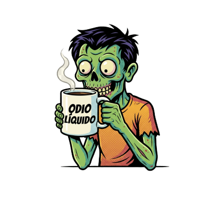
  <br/>
  <em>Zoundvi dice: "Sin cafe no hay video. Asi de simple."</em>
</p>
